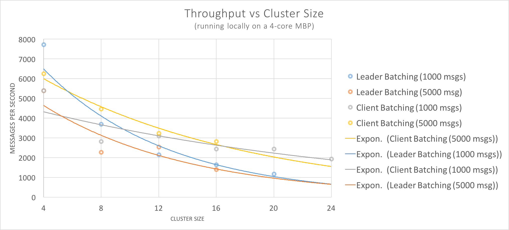

[](https://travis-ci.org/buckie/juno)


<h1 align="center">Juno</h1>
<h6 align="center">Byzantine Fault Tolerant Raft With Smart Contracts</h6>

**NOTE: This is not Kadena's blockchain (ScalableBFT) nor does this blockchain run the Pact Smart Contract language.**
For information about Kadena's proprietary high-performance scalable blockchain, please go to http://kadena.io.

#### Update (2016 Nov 13)

Juno is not longer under active development and hasn't been for some time. 
There were fundamental issues with the protocol and implementation that removed further stability, performance, and scalability gains.

ScalableBFT (protocol and implementation) fixes these issues, achieving 8k-12k transactions per second, fixing or avoiding many of the stability issues with the Tangaroa protocol, and maintaining constant performance whether the cluster runs on 4 servers or 4000. 

Please see http://kadena.io details.

NB: we plan to upgrade Juno to run the Pact Smart Contract language soon so that people can play with it on a true distributed cluster.

#### New Features in 0.0.0.2 Release (2016 April 29)

* **[Performance Improvements](#performance-and-crypto-new-april-2016)**: Juno can achieve consensus for **2000 commits/second**; with client/gateway batching performance jumps to to **~4000/sec**. See demo gif for details.

* **Massively Parallel:**
    Juno scales near-optimally with core count.

* **Upgraded Crypto:**
    Juno now uses the state-of-the art [ed25519-donna](https://github.com/floodyberry/ed25519-donna/) library for lightning-fast crypto.

* **Major State Machine Refactor** modeling each RPC of the Raft state machine into distinct monads

#### Demo (Updated for v0.0.0.2)

<p align="center"></p>

[*What is going on in the demo*](#what-is-going-on-in-the-demo)

#### Throughput Performance

<p align="center"></p>

| Cluster Size | Client Batching (Command/Sec) | Leader Batching (Command/Sec) |
|:------------:|:------------------------------:|:-------------------------------:|
|  4 | 7729 | 5398 |
|  8 | 3698 | 2823 |
| 12 | 2147 | 3100 |
| 16 | 1646 | 2442 |
| 20 | 1179 | 2444 |

See [Performance and Crypto](#performance-and-crypto-new-april-2016) for full description.

***


## Introduction

Juno is a BFT Consensus-based Distributed Cryptoledger providing an alternative to current Blockchain-based Smart-Contract systems.

Blockchain-based approaches to Smart Contract systems are a mismatch for many enterprise applications, as they are purpose-built for *anonymous participation*, necessitating computationally-intensive solutions fault-tolerance and consensus (ie mining, proof-of-stake). Enterprise applications generally have no need to support anonymous actors, so the utility of using consensus algorithms like Paxos or Raft is clear. However no clear solution exists that can provide the Byzantine fault-tolerant (BFT) features of a blockchain on a consensus platform.

Enter Juno, "hardening" the [Raft][Raft] consensus protocol with BFT features. Juno started as a fork of the [Tangaroa][Tangaroa Paper] project, which sought to enhance Raft with BFT features like crypto-signatures of all messages, incremental hashing, and independent commit-proof verification.

With its "BFT-hardened" Raft, Juno achieves vastly greater throughput than traditional Blockchain-based approaches. Our demo shows latencies in the 5ms range (compared with seconds or minutes in Blockchain solutions) and throughput upward of 2000 transactions a second.

## First Principles

For many internal enterprise applications the notion of anonymous participation is anathema; yet this is a fundamental feature of Bitcoin and derivative technologies, requiring Proof-of-Work mining. This provides Blockchain solutions with the means of coming to a distributed consensus about the state of the world: how to get a quorum of servers to agree about *ordering* (what entries come before other entries in the global ledger of transactions) as well as verification of the contents of those entries:

* #1 A means for a distributed cluster to agree on a uniform ordering of messages.

Blockchain-based Smart-Contract systems use the distributed ledger as substrate for storing & ordering commands to run.
Thus, the Smart-Contract layer is a replicated state machine and the Blockchain layer orders what inputs are fed into the RSM:

* #2 A means to step a state machine in a distributed and deterministic way.

As our state machine will be running on multiple nodes at once, we want a very specific type of state machine (language) to interpret and execute our messages.
Ethereum, the current leader in the Smart Contract language space, has several valuable features.
It is deterministic, serializable, has a cost model for execution and is unable to call to the outside world.
All are key features.
We want our replicated state machine to build up the same state given the same inputs and we want to be able to message the machine's state over the wire (or hash it for equivalence checking).
Further, we don't want our state machine to accidentally transfer $10 from Alice to Bob a dozen times because it ran on a dozen servers.
The built up state of our smart contract language is the ledger of truth that other systems can query to get orders from.
Ethereum is a good first step and informs our third principle:

* #3 A language that is deterministic, serializable, unable to perform IO, and has a measure of execution cost.

Blockchains, via Merkle trees or similar data structures, provide a method of quickly validating an immutable copy of historical entries via cryptographic hashes.
Due to anonymous participation, this data structure needs to also be able to handle forks in the chain.
Given that we don't need anonymous participation and thus don't need to be able to handle forks (a correctly functioning node can never encounter them), we can state our fourth principle:

* #4 All entries to our system are stored in an immutable list (log) that can be cryptographically validated.

Though anonymous participation is not a requirement, enterprise applications do need to have strict access and auditability controls.
Blockchain provides this ability via asymmetric keys, used to sign and validate all entries in a given block.
This is a great feature, we want this.
Moreover, as our network is not open to non-authorized actors or servers we need more signing, specifically:

* #5 All network traffic between nodes, as well as all client interactions with the cluster, must be signed and validated. All messages that change the state of the world (either consensus or state machine level) must be persisted in the immutable log.

### #1 Consensus

One can think of ledger entries as simple messages meant for some other system to interpret.
What consensus provides is a means for ordering these messages, which are then fed into some other system.
There are multiple families of algorithms capable of this.

For Juno, we have chosen the Raft protocol as our starting point.
Raft is a Paxos variant designed for understandability.
Simply put, it provides a method for a cluster of servers to elect a Leader as well as a method for replacing the Leader if it goes down.
Once a Leader is selected, it orders messages that it receives & distributes the messages to Followers for replication and application to a state machine.

When we speak of consensus, we mean a way for parts of a system to agree on the state of the world. By using Raft, as opposed to an EPaxos-like system, the messages' meaning are opaque to the consensus layer.

### #2 Replicated State Machine

Once the messages are globally ordered and replicated, they can be interpreted by some other system -- the replicated state machine.
The guarantees that we can do this stem directly from the guarantees of the consensus layer.
In Raft, the Leader only applies an entry to the state machine when it has been replicated by a majority of nodes.

The way this works is as simple as feeding the input into the state machine, along with the state machine's previous state.
In this way any node, Leader or Follower, can build up the same state in their respective state machines.
It is worth noting that the Leader and Followers are constrained from not applying an entry too early (before replication by a majority) but do not necessarily have to apply the messages at the same time.
So long as the order is the same, the system's replicated state machines are eventually consistent.

### #3 Smart Contracts

A Smart Contract is little more than idea of storing code with a value and yet this is a powerful idea.
In enterprise, many systems can be made much simpler by having a way to declare the rules of interaction (workflow) with some value.

Currently, Ethereum is the headline language for Smart Contracts.
It is a very simple, stack based bytecode language that does many things right.
For instance, it is completely serializable and deterministic -- both core features of any smart contract approach done right.
Moreover, it has a model of the price of execution stems; while a great idea, we believe this was poorly executed.
There are several ways that Ethereum can be made better, e.g. a module system.

The language that Juno runs for its replicated state machine is [Hopper][Hopper].
Though still in early development, it will have the following features when completed:

* Declarative/Functional
* Sequentially consistent, fully deterministic, completely serializable
* "Diff-able" per command output representing all state changes
* Measure of execution cost
* Only allows finite-step programs (Turing complete but for a limited step count)
* Linearly Dependent Type system
* Module system
* Built in primitives for common use cases
* Other ownership models are expressible

### #4 Immutable Ledger

Blockchain solves this problem via Merkle Trees.
In Juno, we don't have the ability to have a forked chain (due to the guarantees that Raft provides) and have opted instead for an incrementally hashed log of entries, a la Tangaroa.

It provides a fast way of validating the log of entries and a persistent record of anything of issue that has gone in the past, whether intentional, mistaken or malicious.
This last bit is key, as in enterprise there are usually regulations or legal contracts surrounding transactions and the ledger provides irrefutable proof of everything that has taken place.
As a developer, it is great because it both makes issues easy to replicate but also because it solves a business problem (auditability) very cleanly.

Further, because Raft's Leader Election guarantees that only Candidates with the most up to date logs can get elected, that Leaders can only be elected if they have the votes of a majority of nodes, and that a Leader must replicate an entry to a majority of nodes before applying it, we can be sure that in the event of a partition no committed entry can be lost.

### #5 Cryptographic Verification and Byzantine Fault Tolerance

Blockchain solves this problem by Public-Private key pairs for signatures on and verification of transactions.
Tangaroa's protocol specifies using a similar system, but at the consensus level as well.
This provides a means for one node to validate that a message came from another node (so long as keys haven't been compromised).

Please see the author's paper on the subject, as it goes into further detail on the matter.
Their specification provides good coverage of BFT class issues, but does have some notable gaps (e.g. the Runaway Candidate).

There are a few Byzantine Faults that we explicitly do not care to cover since we believe that any production system will require a "big red button" that sends to cluster into read-only mode.
Among these uncovered faults, that humans actually need to take care of, are Leaders failing to make progress and a Follower finding that its incremental hash disagrees with the majority of nodes.
In the former case, we believe that a Revolution command's existence is more dangerous than a human-intervention procedure wherein the node is manually disconnected or shut down.
For the latter, the Node should transmit it is leaving the consensus group, enter a standby state, dump its logs and wait for human intervention.

### What is going on in the demo

The demo starts by issuing `./demo/start.sh` to launch windows in a `tmux` session. This launches a four-server-node cluster on the right side, and a window for starting the client node.

The four server nodes hold an election shortly after starting, decide on a Leader and become ready to accept commands from the Client.

The rest of the demo can be split into three sections:

#### 1. Setup

Here, we create two accounts, `Acct1` and `Acct2`, which will be used for the remainder of the demo.
The subsequent demo sections use scripted demo-commands that have hard coded names so accounts `Acct1` and `Acct2` must exist.
All of the scripted demo-commands transfer a single dollar from `Acct1` to `Acct2` multiple times, but each in a different way.

As such, we next credits `Acct1` with $100000 and run `ObserveAccounts` to check the current balances of the two accounts (e.g. `Acct1: 100000, Acct2: 0`).
Finally, we demonstrate what a single dollar transfer looks like at the account balance level by transferring $1 from `Acct1` to `Acct2` and rechecking the current balances via `ObserveAccounts`.

As always, each of these commands are sent to the Leader which replicates them to the Followers.
Once the command has been replicated to a majority of nodes, the command is applied by the Leader and a response to the Client is issued.
Followers also apply the final transfer command around this time.

#### 2. Client/Gateway Batching

In scenarios where a gateway or middleware piece is submitting commands into the ledger, the opportunity exists to batch these commands before submission, which can acheive stellar performance.

In the demo, the `batch test:N` simulates this use case. Note that while the commands are batched, the transactions are still distict log entries with independent verification and execution; thus if one transaction fails the others are not impacted.

`batch test:N` creates a batch of `N` individual single dollar transfer commands (i.e. `transfer(Acct1->Acct2, 1%1)`).
The demo shows a batch test of 1000 and then 5000; the output shows the performance measurements for these commands, which is how long it took to achieve the following:

* (Leader) receive the list of commands
* (Leader then Followers) verify the signature of the Command
* (Leader then Followers) replicate the Command to the Followers
* (Leader) collect replication evidence from the Followers
* (Leader) increase its CommitIndex
* (Leader) apply every command in the batch
* (Leader) create the Command Response RPC.

Depending on the hardware, `batch test:8000` can yield a throughput in excess of 7k/sec.

#### 3. Leader/Adaptive Batching

When the cluster receives messages one-by-one, Juno employs an adaptive batching strategy to maximize performance. This is demonstrated in the demo by issuing `many test:N`.

`many test:N` also replicates a single dollar transfer (i.e. `transfer(Acct1->Acct2, 1%1)`) `N` times, but dispatches each command to the cluster as an individual message.
The cluster leader can then detect increasing numbers of messages accumulating in the inbound queue, and create large batches to submit to consensus.

While the performance of this adaptive batching is excellent, we still see a 2x improvement with client-side/gateway batching.

The explanation of the performance numbers found in the previous section holds for the numbers printed along with this command as well.

## Performance and Crypto (New: April 2016)

<p align="center"></p>

Above is a graph of Throughput (Commands per second) vs Cluster Size.
These are very early numbers as they measured via a cluster running locally on a MBP.
Overall though, we are quite happy with the trend lines and expect performance to improve in subsequent iterations.

| Cluster Size | `many test:1000` (Command/Sec) | `batch test:1000` (Command/Sec) |
|:------------:|:------------------------------:|:-------------------------------:|
|  4 | 7729 | 5398 |
|  8 | 3698 | 2823 |
| 12 | 2147 | 3100 |
| 16 | 1646 | 2442 |
| 20 | 1179 | 2444 |

Full crypto takes place for each and every command and cluster message. Here is a sample crypto workflow for the command `ObserveAccounts`:

1. The Client creates a Command RPC (CMD) that holds the `ObserveAccounts` Command
2. The Client signs the CMD with its Private Key and sends the Signed CMD to the Leader.
3. The Leader verifies the Signed CMD's signature against the Client's Public Key and, if valid, replicates the CMD to its Log.
4. The Leader creates an AppendEntries RPC (AE), signs the AE with its Private Key and distributes the Signed AE to each of its Followers.
     AE's can hold 0 or more Log Entries, each holding a individual CMD.
     As such, the original CMD is re-transmitted to the Followers via the AE.
5. Each Follower first verifies the signature on the Signed AE against the Leader's public key.
     If that signature is valid then each Follower then validates every Log Entry's CMD's signature against the Public Key of the originating Client.
     If all of those signatures are valid
       then the Follower replicates the LogEntry (and thus the CMD)
       , creates an Append Entries Response RPC (AER) for the AE, signs the AER with its Private Key, and distributes the AER to every node.
6. Finally, every node independently processes the other node's AER's, validating each against their Public Key.
7. When enough evidence has been collected, each node increases its commit index (independently).

## Roadmap

Juno is still very much in a prototype phase: the demo runs without any persistence, for instance, meaning a full restart of all nodes erases all history. Our focus is on consensus performance currently so there is still much work to do! Such as:

* Persistence (log and RSM)
* RSM signed snapshots
* New operational Node states: standby/read replicas/non-voting nodes
* Key Rotation 

### Thanks & References

Juno is indebted to the ground-breaking work and open-source code by the Tangaroa authors for which we are deeply grateful. We have touched pretty much every line of code so this is no longer a simple Tangaroa fork -- but the original design is still in there, reflecting all the things @chrisnc and @hongxia got so very much right.

A (less huge but still large) thanks to [Verdi Raft] as well. Their demo was the inspiration for one posted above -- very clever.

[Tangaroa Paper]: http://www.scs.stanford.edu/14au-cs244b/labs/projects/copeland_zhong.pdf
[Tangaroa Repo]: https://github.com/chrisnc/tangaroa
[Raft]: https://raft.github.io/
[EPaxos]: https://www.cs.cmu.edu/~dga/papers/epaxos-sosp2013.pdf
[Hopper]: https://github.com/hopper-lang/hopper
[Verdi Raft]: https://github.com/uwplse/verdi


### Build guide

Build requirements:

* `haskell-stack`: `cabal build` will work as well, but `demo/start.sh` uses `stack exec` explicitly
* `zeromq-4`: messaging backend (I use zeromq-4.1.3 but any zeromq >= 4.1.3 && < 5 should work)
* `tmux`: `demo/start.sh` creates a new tmux window and partitions it into multiple panes. NB: if you are using tmux >= 2.1 then you cannot launch the demo from from inside a tmux session (or have other sessions running).
* `rlwrap`: used in `junoclient.sh` to make things more pleasant

For those not using stack, please see stack.yaml for non-hackage deps. Otherwise:

```
stack build
./demo/start.sh
```
