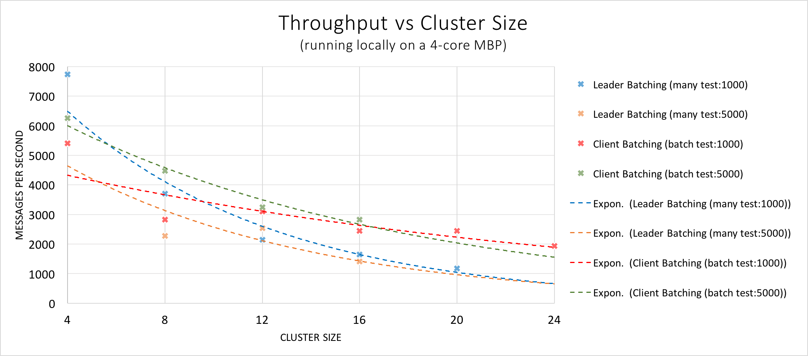

[](https://travis-ci.org/buckie/juno)

### TL;DR

#### Major New Features Since Last Update (Feb 2016 - April 2016)

* [Massive Speed Improvements](#performance-and-crypto): Juno can now come to full consensus of ~2k individual commands per second;
    if the client bathes the messages this number jumps up to ~4k/sec. See the new Demo gif for details.
    (NB: we're not cheating to get to this number -- full Public-Private key crypto is taking place on every single message and command
     + each message is a true individual transaction requiring quorum consensus to be reached before application)
* Massively Parallel:
    Juno now scales near optimally as core count increases. We expect our performance numbers to *increase* as we test on better hardware.
* Better Crypto:
    Juno now uses `ed25519-donna`

#### Quick Demo (Updated: April 2016)

<p align="center"></p>
[What is going on in the demo](#what-is-going-on-in-the-demo)

***

<h1 align="center">Juno</h1>
<h6 align="center">Byzantine Fault Tolerant Raft With Smart Contracts</h6>

### Introduction

Juno is a working prototype that represents an alternative design to current Blockchain-based Smart Contract systems.

Overall Blockchain-based approached to Smart Contract systems have a lot of potential for both public and private applications.
For many private (i.e. enterprise) applications, however, a core capability of Blockchain needs to be explicitly disabled -- that of anonymous participation.
This has large implications for the possible solution space but specifically removes the need mining (Proof of Work), Proof of Stake, etc... to provide consensus and Byzantine Fault Tolerance (BFT).

Instead Juno uses a [Raft][Raft] protocol variant called [Tangaroa][Tangaroa Paper] which is "BFT-hardened" enough to cover the majority of possible Byzantine Faults that we believe an enterprise system should be robust against.
Juno began as a fork of [Tangaroa's Haskell implementation][Tangaroa Repo].
Through the use of a "BFT-hardened" Raft, Juno can achieve vastly lower latency than traditional Blockchain-based approaches -- one based mostly on network latency.
Running the demo locally, one can expect latencies of ~5ms and throughput in excess of 2000 transactions a second.

For the subset of applications that Juno targets (private networks, intra/inter-organization workflows, known participants) similar Blockchain-based approaches generally attempt to decrease latency (caused by mining) by decreasing the difficulty of mining itself.
We believe turning down the difficulty is somewhere between an unfortunate to a dangerous compromise as those systems generally also allow forked chains.
As such, decreasing the difficulty can lead to manipulation of chain.
Some approaches decrease mining difficulty and use some method of Leader Election, Round Robin, etc. to mitigate the danger posed by such a compromise.
We believe this defeats the point of mining.

NB: This is v0.1 release of Juno, our last stable version. Our internal version extends the Tangaroa protocol to fix various edge cases and attack vectors that we've identified.
Hopefully we will be able to publish the protocol's extension and open source this version in coming months, once it becomes stable and release is approved.

## First Principles

For many internal enterprise applications the notion of anonymous participation is anathema.
This is a fundamental feature of Bitcoin and its derivative technologies. It demands the need for Proof of Work, etc. in Blockchain technologies.
As such, removal of this feature implies that mining may be possible to remove entirely.
Mining, however, also provides Blockchain technologies with a means of coming to a distributed consensus about the state of the world.
Specifically, how to get a collective of servers to agree about what entries come before other entries in the global ledger of transactions.
Therein lies our first principle:

* #1 A means for a distributed cluster to agree on order of some sort of message.

Blockchain-based Smart Contract systems use the distributed ledger as substrate for storing & ordering commands to run.
One can think of the Smart Contract system as a REPL and the Blockchain substrate as a means for ordering input commands to the REPL.
Put another way, the Smart Contract layer is a replicated state machine and the Blockchain layer orders what happens when.
This identifies our second principle:

* #2 A means to step a state machine in a distributed and deterministic way.

As our state machine will be running on multiple nodes at once, we want a very specific type of state machine (language) to interpret and execute our messages.
Ethereum, the current leader in the Smart Contract language space, has several valuable features.
It is deterministic, serializable, has a cost model for execution and is unable to call to the outside world.
All are key features.
We want our replicated state machine to build up the same state given the same inputs and we want to be able to message the machine's state over the wire (or hash it for equivalence checking).
Further, we don't want our state machine to accidentally transfer $10 from Alice to Bob a dozen times because it ran on a dozen servers.
The built up state of our smart contract language is the ledger of truth that other systems can query to get orders from.
Ethereum is a good first step and informs our third principle:

* #3 A language that is deterministic, serializable, unable to perform IO, and has a measure of execution cost.

Blockchains, via Merkle trees or similar data structures, provide a method of quickly validating an immutable copy of historical entries via cryptographic hashes.
Due to anonymous participation, this data structure needs to also be able to handle forks in the chain.
Given that we don't need anonymous participation and thus don't need to be able to handle forks (a correctly functioning node can never encounter them), we can state our fourth principle:

* #4 All entries to our system are stored in an immutable list (log) that can be cryptographically validated.

Though anonymous participation is not a requirement, enterprise applications do need to have strict access and auditability controls.
Blockchain provides this ability via asymmetric keys, used to sign and validate all entries in a given block.
This is a great feature, we want this.
Moreover, as our network is not open to non-authorized actors or servers we need more signing, specifically:

* #5 All network traffic between nodes, as well as all client interactions with the cluster, must be signed and validated. All messages that change the state of the world (either consensus or state machine level) must be persisted in the immutable log.

### #1 Consensus

One can think of ledger entries as simple messages meant for some other system to interpret.
What consensus provides is a means for ordering these messages, which are then fed into some other system.
There are multiple families of algorithms capable of this.

For Juno, we have chosen the Raft protocol as our starting point.
Raft is a Paxos variant designed for understandability.
Simply put, it provides a method for a cluster of servers to elect a Leader as well as a method for replacing the Leader if it goes down.
Once a Leader is selected, it orders messages that it receives & distributes the messages to Followers for replication and application to a state machine.

When we speak of consensus, this is what we mean -- a way for parts of a system to agree on the state of the world.
By using Raft, as opposed to an [EPaxos] like system, the messages' meaning may be opaque to the consensus layer.

### #2 Replicated State Machine

Once the messages are globally ordered and replicated, they can be interpreted by some other system -- the replicated state machine.
The guarantees that we can do this stem directly from the guarantees of the consensus layer.
In Raft, the Leader only applies an entry to the state machine when it has been replicated by a majority of nodes.

The way this works is as simple as feeding the input into the state machine, along with the state machine's previous state.
In this way any node, Leader or Follower, can build up the same state in their respective state machines.
It is worth noting that the Leader and Followers are constrained from not applying an entry too early (before replication by a majority) but do not necessarily have to apply the messages at the same time.
So long as the order is the same, the system's replicated state machines are eventually consistent.

### #3 Smart Contracts

A Smart Contract is little more than idea of storing code with a value and yet this is a powerful idea.
In enterprise, many systems can be made much simpler by having a way to declare the rules of interaction (workflow) with some value.

Currently, Ethereum is the headline language for Smart Contracts.
It is a very simple, stack based bytecode language that does many things right.
For instance, it is completely serializable and deterministic -- both core features of any smart contract approach done right.
Moreover, it has a model of the price of execution stems; while a great idea, we believe this was poorly executed.
There are several ways that Ethereum can be made better, e.g. a module system.

The language that Juno runs for its replicated state machine is [Hopper][Hopper].
Though still in early development, it will have the following features when completed:

* Declarative/Functional
* Sequentially consistent, fully deterministic, completely serializable
* "Diff-able" per command output representing all state changes
* Measure of execution cost
* Only allows finite-step programs (Turing complete but for a limited step count)
* Linearly Dependent Type system
* Module system
* Built in primitives for common use cases
* Other ownership models are expressible

### #4 Immutable Ledger

Blockchain solves this problem via Merkle Trees.
In Juno, we don't have the ability to have a forked chain (due to the guarantees that Raft provides) and have opted instead for an incrementally hashed log of entries, a la Tangaroa.

It provides a fast way of validating the log of entries and a persistent record of anything of issue that has gone in the past, whether intentional, mistaken or malicious.
This last bit is key, as in enterprise there are usually regulations or legal contracts surrounding transactions and the ledger provides irrefutable proof of everything that has taken place.
As a developer, it is great because it both makes issues easy to replicate but also because it solves a business problem (auditability) very cleanly.

Further, because Raft's Leader Election guarantees that only Candidates with the most up to date logs can get elected, that Leaders can only be elected if they have the votes of a majority of nodes, and that a Leader must replicate an entry to a majority of nodes before applying it, we can be sure that in the event of a partition no committed entry can be lost.

### #5 Cryptographic Verification and Byzantine Fault Tolerance

Blockchain solves this problem by Public-Private key pairs for signatures on and verification of transactions.
Tangaroa's protocol specifies using a similar system, but at the consensus level as well.
This provides a means for one node to validate that a message came from another node (so long as keys haven't been compromised).

Please see the author's paper on the subject, as it goes into further detail on the matter.
Their specification provides good coverage of BFT class issues, but does have some notable gaps (e.g. the Runaway Candidate).

There are a few Byzantine Faults that we explicitly do not care to cover since we believe that any production system will require a "big red button" that sends to cluster into read-only mode.
Among these uncovered faults, that humans actually need to take care of, are Leaders failing to make progress and a Follower finding that its incremental hash disagrees with the majority of nodes.
In the former case, we believe that a Revolution command's existence is more dangerous than a human-intervention procedure wherein the node is manually disconnected or shut down.
For the latter, the Node should transmit it is leaving the consensus group, enter a standby state, dump its logs and wait for human intervention.

### What is going on in the demo

The previous demo's purpose was to show the fundamentals of Juno working as expected.
The current demo's purpose is to show the various upgrades we've made, specifically the performance ones.

The demo starts with `./demo/start.sh` which causes a four server-node cluster (right side) and a Client node (left side) to be started.
The four server nodes hold an election shortly after starting, decide on a Leader and become ready to accept commands from the Client.

The rest of the demo can be split into three sections:

#### 1. Prelude (New: April 2016)

Here, we create two accounts, `Acct1` and `Acct2`, which will be used for the remainder of the demo.
The subsequent demo sections use scripted demo-commands that have hard coded names so accounts `Acct1` and `Acct2` must exist.
All of the scripted demo-commands transfer a single dollar from `Acct1` to `Acct2` multiple times, but each in a different way.

As such, we next credits `Acct1` with $100000 and run `ObserveAccounts` to check the current balances of the two accounts (e.g. `Acct1: 100000, Acct2: 0`).
Finally, we demonstrate what a single dollar transfer looks like at the account balance level by transferring $1 from `Acct1` to `Acct2` and rechecking the current balances via `ObserveAccounts`.

As always, each of these commands are sent to the Leader which replicates them to the Followers.
Once the command has been replicated to a majority of nodes, the command is applied by the Leader and a response to the Client is issued.
Followers also apply the final transfer command around this time.

#### 2. Client Batching (New: April 2016)

The first scripted demo-command we show is `batch test:N` which demonstrates Juno's throughput when clients are able to bundle individual commands into a single message.
Again, each command is treated as a distinct entry in the log.
Client Batching is no more than the Client sending the Leader a list of Commands to the Leader.
If one of these Commands fails, it does not impact the others.

`batch test:N` will create a list of individual single dollar transfer commands (i.e. `transfer(Acct1->Acct2, 1%1)`) of length `N`.
In the demo, we show first a batch test of 1000 and then a batch test of 5000.
Performance numbers are included for these commands and they are a measurement of how long it took the Leader fully process each the entire list of commands.
This includes the time it took to do the following for each command in the list:

* (Leader) receive the list of commands
* (Leader then Followers) verify the signature of the Command
* (Leader then Followers) replicate the Command to the Followers
* (Leader) collect replication evidence from the Followers
* (Leader) increase its CommitIndex
* (Leader) apply every command in the batch
* (Leader) create the Command Response RPC.

Depending on the hardware, `batch test:8000` can yield a throughput in excess of 7k/sec.

#### 3. Leader Batching (New: April 2016)

The optimal batching strategy is for the Client to hand batches of Commands to the the Leader.
However, this is only applicable in a few use cases.
For most use cases the Client isn't capable of doing this and instead the Leader must also be able to batch inbound Commands.

To this end, we creates the second scripted demo-command `many test:N`.
`many test:N` is similar to `batch test:N` in so much as it replicates a single dollar transfer (i.e. `transfer(Acct1->Acct2, 1%1)`) `N` times.
However, instead of sending `N` commands as a single list of commands to the leader (as `batch test:N` did) `many test:N` fires off each command as an individual message to the Leader as fast as it can.
This creates a large backlog of new commands in the Leader's message pipeline that it then attempts to batch.

As the Leader has no way of knowing how many Commands are inbound and thus cannot batch as optimally.
We've completely a first pass at implementing this system, but it still is 2x slower than the best-case of Client batching.

The explanation of the performance numbers found in the previous section holds for the numbers printed along with this command as well.

## Performance and Crypto (New: April 2016)

<p align="center"></p>

Above is a graph of Throughput (Commands per second) vs Cluster Size.
These are very early numbers as they measured via a cluster running locally on a MBP.
Overall though, we are quite happy with the trend lines and expect performance to improve in subsequent iterations.

Fully crypto takes place for each and every command and cluster message. Here is a sample crypto workflow for the command `ObserveAccounts`:

1. The Client creates a Command RPC (CMD) that holds the `ObserveAccounts` Command
2. The Client signs the CMD with its Private Key and sends the Signed CMD to the Leader.
3. The Leader verifies the Signed CMD's signature against the Client's Public Key and, if valid, replicates the CMD to its Log.
4. The Leader creates an AppendEntries RPC (AE), signs the AE with its Private Key and distributes the Signed AE to each of its Followers.
     AE's can hold 0 or more Log Entries, each holding a individual CMD.
     As such, the original CMD is re-transmitted to the Followers via the AE.
5. Each Follower first verifies the signature on the Signed AE against the Leader's public key.
     If that signature is valid then each Follower then validates every Log Entry's CMD's signature against the Public Key of the originating Client.
     If all of those signatures are valid
       then the Follower replicates the LogEntry (and thus the CMD)
       , creates an Append Entries Response RPC (AER) for the AE, signs the AER with its Private Key, and distributes the AER to every node.
6. Finally, every node independently processes the other node's AER's, validating each against their Public Key.

## What's Coming up Next (Updated: April 2016)

This version of Juno represents an early iteration that the authors were given permission to Open Source.
Though we are continuing to work on it, it still needs much more work before it is ready for a production deployment.
I would recommend against forking off of it/iterating on it in its current state given the plans we have and the issues with the current version.

We hope to also have:

* persistence via SQLite
* signed snapshots
* additional Node states: standby/read replicas/non-voting nodes, read-only due to unrecoverable issue
* key rotation commands

Please be patient, much more is coming.

### Thanks & References

A huge thanks to Tangaroa's authors for creating and open sourcing their work.
Though this release has been refactored a bit, it is largely an untouched fork of Tangaroa -- @chrisnc and @hongxia got so very much right.
I feel justified in changing the name to Juno only because I know what the general shape of the next version will look like, a near total refactor.

A (less huge but still large) thanks to [Verdi Raft] as well. Their demo was the inspiration for one posted above -- very clever.

[Tangaroa Paper]: http://www.scs.stanford.edu/14au-cs244b/labs/projects/copeland_zhong.pdf
[Tangaroa Repo]: https://github.com/chrisnc/tangaroa
[Raft]: https://raft.github.io/
[EPaxos]: https://www.cs.cmu.edu/~dga/papers/epaxos-sosp2013.pdf
[Hopper]: https://github.com/hopper-lang/hopper
[Verdi Raft]: https://github.com/uwplse/verdi


### Build guide

Build requirements:

* `haskell-stack`: `cabal build` will work as well, but `demo/start.sh` uses `stack exec` explicitly
* `zeromq-4`: messaging backend (I use zeromq-4.1.3 but any zeromq >= 4.1.3 && < 5 should work)
* `tmux`: `demo/start.sh` creates a new tmux window and partitions it into multiple panes. NB: if you are using tmux >= 2.1 then you cannot launch the demo from from inside a tmux session (or have other sessions running).
* `rlwrap`: used in `junoclient.sh` to make things more pleasant

For those not using stack, please see stack.yaml for non-hackage deps. Otherwise:

```
stack build
./demo/start.sh
```
